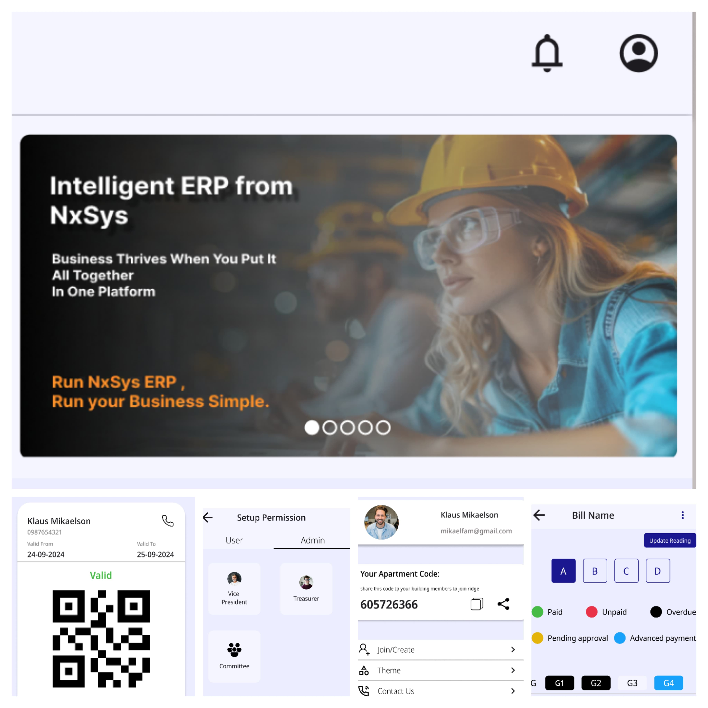

🏢 Building Management System (BMS)
Overview
The Building Management System (BMS) is a centralized platform designed to monitor, control, and automate various building operations. It supports functionalities like equipment scheduling, access control, energy monitoring, maintenance tracking, and real-time alerts, enhancing efficiency and safety for building administrators.

🔧 Features
Dashboard Overview: Real-time stats for building occupancy, power usage, HVAC status, and security alerts.

Access Control: Manage staff/visitor entry with role-based permissions and logs.

Energy Monitoring: Track energy consumption across zones with historical reporting.

HVAC Control: Automate and remotely manage heating, ventilation, and air conditioning.

Maintenance Scheduler: Schedule and log regular maintenance activities with automated reminders.

Alert System: Get instant notifications for unusual activity or system failures (email/SMS/push).

User Management: Admins can add, edit, and assign roles to building staff and tenants.

Reports: Generate custom reports on system usage, faults, and maintenance records.

🛡️ Security
All endpoints secured via JWT/OAuth2.

Rate-limiting and IP blocking included.

Admin access protected via RBAC.

📈 Scalability & Extensibility
Microservice-ready backend

Modular frontend components

Plugin support for third-party systems (e.g., fire alarms, elevators, IoT sensors)

🤝 Contributing
Contributions are welcome! Please follow the contribution guidelines in CONTRIBUTING.md and raise an issue before submitting a PR.

📄 License
This project is licensed under the MIT License – see the LICENSE file for details.

📬 Contact
Dhruv Chopra
Venus Solutions
